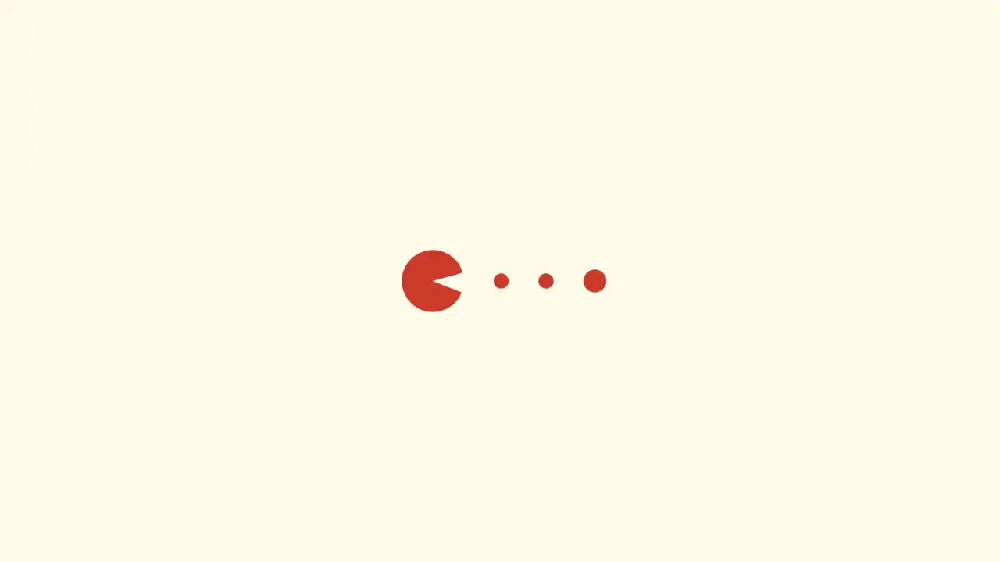
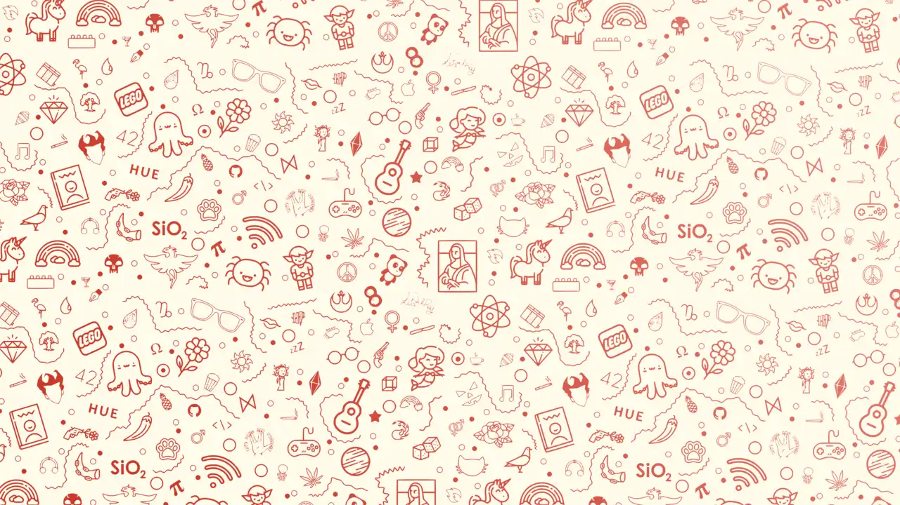
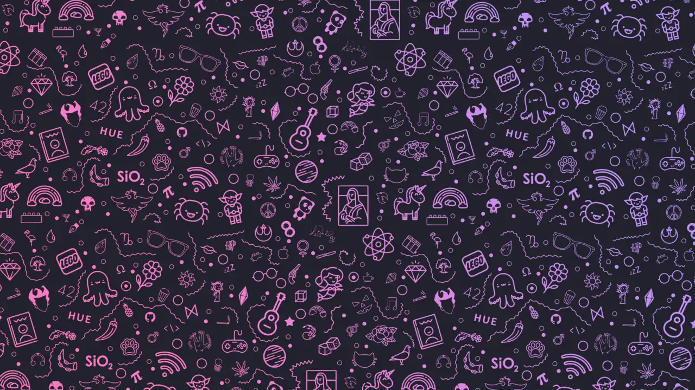

<h1 align="center">Wallpapers</h1>

<div align="center">

_A curated collection of my personal wallpapers_

[](https://github.com/druxorey/wallpapers/stargazers)
[](https://github.com/druxorey/wallpapers)
[](https://visitorbadge.io/status?path=https%3A%2F%2Fgithub.com%2Fdruxorey%2Fwallpapers)
[](https://github.com/druxorey/wallpapers/blob/main/LICENSE)

</div>

## About

This repository hosts my personal collection of wallpapers, selected and organized to match my desktop setups. Most of them are tailored to complement dark aesthetics like **Dracula** or clean light themes like **Alucard**.

## How to Use

You can download the wallpapers manually or clone the entire repository to your local machine:

```bash
git clone https://github.com/druxorey/wallpapers.git ~/Pictures/Wallpapers
```

## Gallery
| Alucard | Dracula |
| ------- | ------- |
| <div align="center"><a href="Alucard/A024.jxl"></a><br><a href="https://github.com/druxorey/Wallpapers/raw/refs/heads/main/Alucard/A024.jxl">Download</a></div> | <div align="center"><a href="Dracula/D024.jxl"></a><br><a href="https://github.com/druxorey/Wallpapers/raw/refs/heads/main/Dracula/D024.jxl">Download</a></div> |
| <div align="center"><a href="Alucard/A025.jxl"></a><br><a href="https://github.com/druxorey/Wallpapers/raw/refs/heads/main/Alucard/A025.jxl">Download</a></div> | <div align="center"><a href="Dracula/D025.jxl"></a><br><a href="https://github.com/druxorey/Wallpapers/raw/refs/heads/main/Dracula/D025.jxl">Download</a></div> |
| <div align="center"><a href="Alucard/A026.jxl"></a><br><a href="https://github.com/druxorey/Wallpapers/raw/refs/heads/main/Alucard/A026.jxl">Download</a></div> | <div align="center"><a href="Dracula/D026.jxl"></a><br><a href="https://github.com/druxorey/Wallpapers/raw/refs/heads/main/Dracula/D026.jxl">Download</a></div> |
| <div align="center"><a href="Alucard/A028.jxl"></a><br><a href="https://github.com/druxorey/Wallpapers/raw/refs/heads/main/Alucard/A028.jxl">Download</a></div> | <div align="center"><a href="Dracula/D028.jxl"></a><br><a href="https://github.com/druxorey/Wallpapers/raw/refs/heads/main/Dracula/D028.jxl">Download</a></div> |
| <div align="center"><a href="Alucard/A029.jxl"></a><br><a href="https://github.com/druxorey/Wallpapers/raw/refs/heads/main/Alucard/A029.jxl">Download</a></div> | <div align="center"><a href="Dracula/D029.jxl"></a><br><a href="https://github.com/druxorey/Wallpapers/raw/refs/heads/main/Dracula/D029.jxl">Download</a></div> |
| <div align="center"><a href="Alucard/A030.jxl"></a><br><a href="https://github.com/druxorey/Wallpapers/raw/refs/heads/main/Alucard/A030.jxl">Download</a></div> | <div align="center"><a href="Dracula/D030.jxl"></a><br><a href="https://github.com/druxorey/Wallpapers/raw/refs/heads/main/Dracula/D030.jxl">Download</a></div> |
| <div align="center"><a href="Alucard/A033.jxl"></a><br><a href="https://github.com/druxorey/Wallpapers/raw/refs/heads/main/Alucard/A033.jxl">Download</a></div> | <div align="center"><a href="Dracula/D033.jxl"></a><br><a href="https://github.com/druxorey/Wallpapers/raw/refs/heads/main/Dracula/D033.jxl">Download</a></div> |
| <div align="center"><a href="Alucard/A059.jxl"></a><br><a href="https://github.com/druxorey/Wallpapers/raw/refs/heads/main/Alucard/A059.jxl">Download</a></div> | <div align="center"><a href="Dracula/D059.jxl"></a><br><a href="https://github.com/druxorey/Wallpapers/raw/refs/heads/main/Dracula/D059.jxl">Download</a></div> |
| <div align="center"><a href="Alucard/A061.jxl"></a><br><a href="https://github.com/druxorey/Wallpapers/raw/refs/heads/main/Alucard/A061.jxl">Download</a></div> | <div align="center"><a href="Dracula/D061.jxl"></a><br><a href="https://github.com/druxorey/Wallpapers/raw/refs/heads/main/Dracula/D061.jxl">Download</a></div> |
| <div align="center"><a href="Alucard/A066.jxl"></a><br><a href="https://github.com/druxorey/Wallpapers/raw/refs/heads/main/Alucard/A066.jxl">Download</a></div> | <div align="center"><a href="Dracula/D066.jxl"></a><br><a href="https://github.com/druxorey/Wallpapers/raw/refs/heads/main/Dracula/D066.jxl">Download</a></div> |
## License

This project is licensed under the GPL-3.0 License. See the [LICENSE](LICENSE) file for more details.

